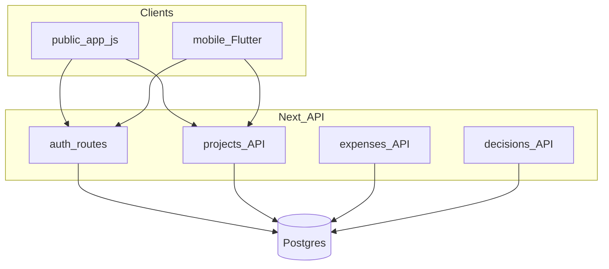
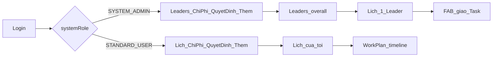
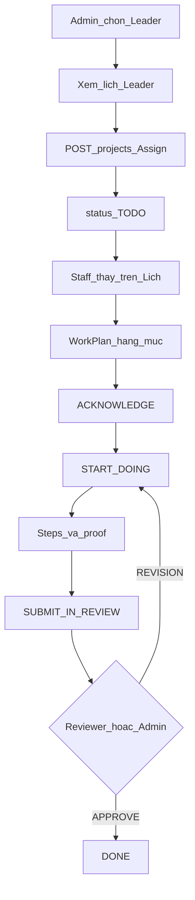
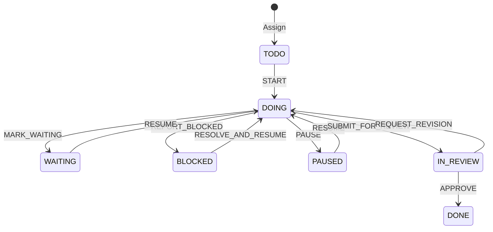
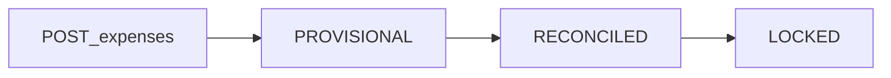
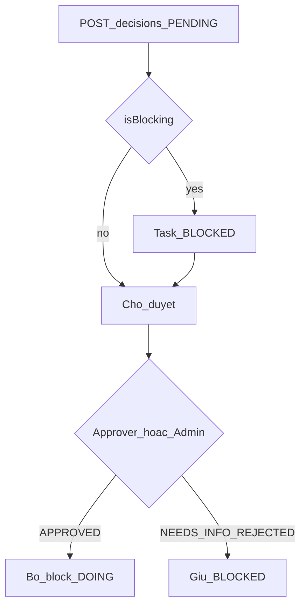

# Flow hoạt động app HHG Oasis (hiện trạng)

Nguồn sự thật dựa trên code đang chạy:

- [`prisma/schema.prisma`](../prisma/schema.prisma)
- [`src/lib/auth.ts`](../src/lib/auth.ts), [`src/lib/session.ts`](../src/lib/session.ts), [`src/lib/task-workflow.ts`](../src/lib/task-workflow.ts), [`src/lib/task-risk.ts`](../src/lib/task-risk.ts)
- [`src/app/api/`](../src/app/api/)
- [`public/app.js`](../public/app.js), [`public/index.html`](../public/index.html)
- [`mobile/lib/screens/`](../mobile/lib/screens/)

**Quy ước tên:** UI gọi **Task** = Prisma model **`Project`**.

---

## 1. Actors và bề mặt

| Actor | SystemRole | App chính |
|-------|------------|-----------|
| ADMINISTRATION | `SYSTEM_ADMIN` | Flutter/Web: **Leaders** |
| Leader / Staff | `STANDARD_USER` | Flutter/Web: **Lịch của tôi** |
| Không login | — | Web Tổng quan / Chốt ngày / Chi phí (hạn chế) |

Session: JWT trong cookie httpOnly `hhg_session` ([`src/lib/session.ts`](../src/lib/session.ts)). Flutter lưu giá trị cookie rồi gửi lại header `Cookie`.

---

## 2. Shell theo role

- Tab **Task** đã ẩn khỏi bottom nav; danh sách nằm trong **Thêm → Danh sách Task** ([`mobile/lib/screens/home_shell.dart`](../mobile/lib/screens/home_shell.dart)).
- Chỉ Admin giao Task cho người khác ([`src/app/api/projects/route.ts`](../src/app/api/projects/route.ts)). Staff tạo Task (nếu có) thì owner = chính mình.

---

## 3. Happy path Task

### Màn Flutter theo bước

| Bước | Screen |
|------|--------|
| Roster Leaders | [`admin_leaders_screen.dart`](../mobile/lib/screens/admin_leaders_screen.dart) |
| Lịch 1 Leader + FAB | [`admin_schedule_screen.dart`](../mobile/lib/screens/admin_schedule_screen.dart) |
| Form giao Task | [`create_task_screen.dart`](../mobile/lib/screens/create_task_screen.dart) |
| Lịch Staff | [`staff_schedule_screen.dart`](../mobile/lib/screens/staff_schedule_screen.dart) |
| Hạng mục + giàn thời gian | [`work_plan_timeline_screen.dart`](../mobile/lib/screens/work_plan_timeline_screen.dart) |
| Workflow actions | [`task_detail_screen.dart`](../mobile/lib/screens/task_detail_screen.dart) |

- Gate / `allowedActions`: [`src/lib/task-workflow.ts`](../src/lib/task-workflow.ts)
- Deadline risk chỉ overlay (không đổi status): [`src/lib/task-risk.ts`](../src/lib/task-risk.ts)

---

## 4. Máy trạng thái Task

| Action | From → To | Ai |
|--------|-----------|-----|
| `ACKNOWLEDGE` / `FORCE_ACKNOWLEDGE` | (giữ TODO) + `acknowledgedAt` | PRIMARY / Admin override |
| `START` | TODO → DOING | PRIMARY / Admin |
| `MARK_WAITING` | DOING → WAITING | PRIMARY / Admin |
| `REPORT_BLOCKED` | DOING → BLOCKED | PRIMARY / Admin |
| `PAUSE` | DOING → PAUSED | PRIMARY / Admin |
| `RESUME` | WAITING/PAUSED → DOING | PRIMARY / Admin |
| `RESOLVE_AND_RESUME` | BLOCKED → DOING | PRIMARY / Admin |
| `SUBMIT_FOR_REVIEW` | DOING → IN_REVIEW | PRIMARY (cần ack + steps + proof) |
| `FORCE_SUBMIT_FOR_REVIEW` | DOING → IN_REVIEW | Admin (+ reason) |
| `APPROVE` | IN_REVIEW → DONE | Reviewer / Admin |
| `REQUEST_REVISION` | IN_REVIEW → DOING | Reviewer / Admin |

Status **chỉ** đổi qua `PATCH /api/projects/:id` với `body.action` — không set status tự do.

---

## 5. Chi phí — không phải đề xuất AI

- Mọi user login có thể **ghi nhận chi thật** (nội dung, số tiền, phân khu, gắn Task).
- Lưu mặc định **Tạm ghi nhận** (`PROVISIONAL`).
- Đối chiếu → chốt: chủ yếu **Admin trên web** (Flutter hiện tạo + list).
- **Không** đổi status Task khi ghi / đối chiếu chi phí.

API: [`src/app/api/expenses/route.ts`](../src/app/api/expenses/route.ts), [`src/app/api/expenses/[id]/route.ts`](../src/app/api/expenses/[id]/route.ts).

---

## 6. Quyết định — xin duyệt, không chỉ Admin tạo

- Mọi user login có thể **tạo yêu cầu duyệt** (`PENDING`).
- Nếu `isBlocking`: Task/Project liên quan → `BLOCKED`.
- Duyệt / từ chối / cần bổ sung: approver (khớp tên) hoặc `SYSTEM_ADMIN`.
- Flutter: tạo yêu cầu; **web** có nút duyệt đầy đủ.

API: [`src/app/api/decisions/route.ts`](../src/app/api/decisions/route.ts), [`src/app/api/decisions/[id]/route.ts`](../src/app/api/decisions/[id]/route.ts).

---

## 7. Bảng phân biệt nhanh

| Module | Ai tạo | Bản chất |
|--------|--------|---------|
| Chi phí | Mọi user login | Ghi số thật, chờ đối chiếu — **không** phải đề xuất AI |
| Quyết định | Mọi user login | Xin duyệt; Admin/approver **xử lý** |
| Giao Task cho Leader | Chỉ Admin | Assign xuống cấp dưới |

---

## 8. Ngoài happy path (có trong code)

- Collaborator báo issue → Owner escalate blocker
- Owner xin đổi deadline / priority → Admin duyệt
- AI inbox / Lead cũ: deferred / `?debug=1` trên web
- Legacy rows `Task` + `/api/tasks` (“Công việc cũ”)

---

## Web sidebar (tham chiếu nhanh)

| Nav | Logged out | Admin | Staff |
|-----|------------|-------|-------|
| Tổng quan / Chốt ngày / Chi phí | Có | Có | Có |
| Leaders | — | Có | — |
| Lịch của tôi | — | — | Có |
| Task / Vấn đề / Quyết định / Tài liệu | — | Có | Có |
| AI / Lead / Blueprint | `?debug=1` | same | same |

Body classes: `hhg-overview` | `hhg-admin` | `hhg-staff` ([`public/app.js`](../public/app.js)).
