# HHG Oasis Control Tower — System Audit (Current State)

**Date:** 2026-09-20  
**Scope:** Codebase as deployed (`public/index.html` + `public/app.js` + Next.js API + Prisma Postgres)  
**Rules followed:** Read-only. No redesign proposals. No Leader/Department/Role assumptions unless present in code.  
**Primary UI surface:** `/index.html` (static SPA). Next `/` is a stub linking to that SPA.

---

# 1. System Overview

Hệ thống hiện tại là **một SPA HTML/JS** phục vụ bởi Next.js, với **Prisma Postgres** làm nguồn dữ liệu thật cho một phần module.

**Stack thực tế:**
- Frontend: `public/index.html` + `public/app.js` (vanilla JS, không React components cho Control Tower)
- Backend: Next.js App Router API routes dưới `src/app/api/**`
- DB: Prisma schema → PostgreSQL (`DATABASE_URL`)
- AI: rule-based trong `src/lib/ai.ts` (không gọi LLM bên ngoài)

**Không có trong codebase:** User model, Role/Permission model, Department, Leader hierarchy, Auth, localStorage persistence, React feature pages cho từng module.

**Kiến trúc vận hành:**
```
Browser → /index.html + app.js
              ↓ fetch
         /api/* (Next route handlers)
              ↓
         Prisma → Postgres
```

**Đặc điểm lớn nhất:** Backend đã aggregate nhiều dữ liệu qua `/api/dashboard`, nhưng **Dashboard / Finance read-model / Expense analytics** vẫn chủ yếu là **HTML cứng**. Nhiều nút write API hoạt động, nhưng UI tổng hợp không luôn refresh từ DB.

---

# 2. Feature Inventory

| ID | Module/Page | Route | Chức năng | Dữ liệu sử dụng | Nguồn dữ liệu | Có CRUD? | Có liên kết module khác? |
|----|-------------|-------|-----------|-----------------|---------------|----------|--------------------------|
| F01 | Home stub | `/` | Link sang SPA + API health | — | Static | Read | Nav to SPA |
| F02 | Control Tower SPA | `/index.html` | Toàn bộ UI điều hành | Mixed | HTML + `/api/dashboard` + module APIs | Mixed | All modules |
| F03 | Dashboard | `?view=dashboard` | Metrics, ưu tiên, quyết định chờ, phân khu, rủi ro | HTML numbers + `#dashDecisions` | **Mostly hardcoded HTML**; decisions from DB | Read (partial) | Decisions (REAL); Units/Revenue (DISPLAY/MOCK) |
| F04 | Projects | `?view=projects` | Danh sách dự án + tạo mới | Project, Task counts, Decision counts | Prisma via dashboard/projects | Create + Read | Task, Decision, Unit |
| F05 | Tasks | `?view=tasks` | Bảng việc + filter + tạo việc | Task (+ unit, project) | Prisma | Create + Read + Update (via detail) | Project, Unit, Decision, Expense |
| F06 | AI Inbox | `?view=ai` | Phân tích tin nhắn → drafts → confirm/skip/merge | MessageInbox, AiTaskDraft, Task | Prisma + `src/lib/ai.ts` | Create/Read/Update (drafts) | Task (on confirm); Unit by name |
| F07 | Decisions | `?view=decisions` | DS quyết định + duyệt/từ chối/bổ sung | Decision, linked Task/Project | Prisma | Create + Read + Update | Task (LOGIC REAL), Project (DATA) |
| F08 | Finance / Daily Close | `?view=finance` | Bảng chốt ngày (UI) + form nhập | DailyClose, Unit | **Table HARDCODED**; POST REAL | Create/Upsert write; Read UI fake | Unit; Dashboard (broken display sync) |
| F09 | Expenses | `?view=expenses` | DS chi phí + ghi chi + đối chiếu | Expense, Unit, linked Task | List REAL; analytics HARDCODED | Create + Read + Patch status | Task (optional); Unit; AI classify |
| F10 | Staff app | `?view=staff` | Việc của tôi / lịch sử / status buttons | Task | Prisma tasks (all non-DONE, not per-user) | Update status | Task |
| F11 | Issue report | `?view=issue` | Báo vấn đề QR-style | Issue, Unit | Prisma POST | Create only (no list UI) | Unit only |
| F12 | Blueprint | `?view=blueprint` | Copy sơ đồ hệ thống | — | Static HTML | None | None |
| F13 | Task detail modal | (modal) | Chi tiết, tiến độ, chứng từ, lịch sử, yêu cầu quyết định | Task, TaskEvent, Expense, Decision | Prisma / state | Update progress | Decision, Expense |
| F14 | Role selector | topbar | Chọn vai trò | — | HTML only | None | **No permission effect** |
| F15 | Mobile menu | sidebar | Nav mobile | — | CSS/checkbox | Nav only | Views |
| F16 | Units API | `/api/units` | List units | Unit | Prisma | Read | — |
| F17 | AI classify | `/api/ai/classify` | Gợi ý expense/revenue category | text rules | `src/lib/ai.ts` only | Stateless | Expense/Finance forms |
| F18 | Seed Trung Thu | script | 38 tasks event | Project + Task | `prisma/seed-trungthu.ts` | Seed write | Project→Task |

---

# 3. Entity Inventory

**Không có:** User, Role, Permission, Department, Leader, Revenue (as entity), Priority (as entity).

| Entity | File định nghĩa | Fields chính | ID | Status field | Owner field | Relations | Được dùng ở đâu |
|--------|-----------------|--------------|-----|--------------|-------------|-----------|-----------------|
| **Unit** | `prisma/schema.prisma` | name, sortOrder | cuid | — | — | → Project, Task, DailyClose, Expense, Issue | API lookup by name; seed; filters |
| **Project** | schema | name, category, owner, budget, deadline, readiness, status | cuid | ON_TRACK / AT_RISK / BLOCKED | `owner` String? | unitId→Unit; tasks; decisions | Projects UI, Decision link, Task.project |
| **Task** | schema | code, title, priority, owner, deadline, status, cost, blocker, progress, note, sourceMessageId, sourceDraftId | cuid | TODO/DOING/WAITING/BLOCKED/DONE | `owner` String? | unitId; projectId; events; decisions; expenses | Tasks, Staff, AI confirm, Decision, Expense link |
| **TaskEvent** | schema | label, detail | cuid | — | — | taskId→Task | Task history; Decision resolve; AI merge/confirm |
| **Decision** | schema | code, title, description, amountLabel, proposer, approver, deadline, impact, isBlocking, status, resolution*, resolved* | cuid | PENDING/APPROVED/NEEDS_INFO/REJECTED | proposer/approver strings | linkedTaskId; linkedProjectId | Decisions UI; Dashboard strip; Task panel |
| **DailyClose** | schema | date, revenue, cashCollected, guestCount, source, note, status | cuid | PROVISIONAL/RECONCILED/LOCKED | — | unitId→Unit; @@unique(unitId,date) | API + dashboard summary; **Finance table UI not bound** |
| **Expense** | schema | code, category, categoryLabel, amount, content, source, taskRef, status, ai*, humanConfirmed | cuid | PROVISIONAL/RECONCILED/LOCKED | — | unitId; linkedTaskId→Task (**no Project**) | Expenses UI; dashboard summary; docs modal |
| **Issue** | schema | category, note, areaLabel, status | cuid | OPEN (only used) | — | unitId→Unit (**no Task**) | Issue form POST only; dashboard returns issues unused by UI |
| **MessageInbox** | schema | sourceChannel, rawText, senderDisplayName, status | cuid | NEW/ANALYZED (REVIEWED/ARCHIVED unused) | senderDisplayName | drafts[] | AI inbox |
| **AiTaskDraft** | schema | parentGroup, suggested*, duplicate*, confidence, reason, reviewStatus, createdTaskId | cuid | PENDING/EDITED/CONFIRMED/MERGED/SKIPPED | suggestedOwner | messageId→MessageInbox; createdTaskId/duplicateTaskId **string only** | AI inbox |
| **Priority** | — | — | — | — | — | **NOT an entity** — Task.priority string P0/P1/P2 | Task forms/filters |
| **Revenue** | — | — | — | — | — | **NOT an entity** — field on DailyClose + HTML metrics | Finance/Dashboard |
| **User/Role** | — | — | — | — | — | **Do not exist** | roleSelect is UI chrome only |

---

# 4. Module Connection Map

| From | To | Connection Type | Cách kết nối | File/logic | Real hay Mock |
|------|-----|-----------------|--------------|------------|---------------|
| Task | Project | DATA | `Task.projectId` | schema + dashboard include | REAL |
| Task | Unit | DATA | `Task.unitId` | schema + unitName lookup | REAL |
| Task | TaskEvent | DATA + LOGIC | cascade events on create/patch/resolve | tasks/[id], decisions/[id], ai/drafts | REAL |
| Decision | Task | DATA + LOGIC | `linkedTaskId`; create blocks task; resolve updates status/blocker/events | decisions/route.ts, decisions/[id] | REAL |
| Decision | Project | DATA | `linkedProjectId` or resolve via `projectName` / task.project | decisions/route.ts | REAL (name-based resolve fragile) |
| Expense | Task | DATA | `linkedTaskId` optional | expenses; openExpenseLinkedTask | REAL (often null; taskRef string parallel) |
| Expense | Unit | DATA | `unitId` | expenses | REAL |
| Expense | Project | — | none | schema | **NO CONNECTION** |
| DailyClose | Unit | DATA | `unitId` + unique date | daily-closes | REAL |
| DailyClose | Dashboard summary | DATA (API) / DISPLAY (UI) | API sums closes; UI metrics hardcoded | dashboard/route.ts vs index.html | **API REAL / UI MOCK** |
| Issue | Unit | DATA | `unitId` | issues | REAL |
| Issue | Task | — | none | schema | **NO CONNECTION** |
| Issue | Decision | — | none | — | **NO CONNECTION** |
| AI Draft | Task | LOGIC | confirm creates Task; merge writes TaskEvent | ai/drafts/[id] | REAL |
| AI Draft | Task | DATA (weak) | `createdTaskId`, `duplicateTaskId` strings | schema | PARTIAL (no Prisma relation) |
| Task | Message/Draft | DATA (weak) | `sourceMessageId`, `sourceDraftId` strings | schema | PARTIAL |
| AI classify | Expense form | LOGIC (client) | fills category/unit before save | app.js suggestExpenseDemo | REAL suggest, optional |
| AI classify | DailyClose | DISPLAY | revenue suggest box; **not saved** | suggestRevenueDemo | **FAKE persistence** |
| Project | Task | DISPLAY | project card shows task done/total | renderProjects | REAL counts |
| Project | Decision | DISPLAY | pending decision count on card | renderProjects | REAL counts |
| Dashboard | Decisions | DISPLAY | `#dashDecisions` from same renderDecisions | app.js | REAL |
| Dashboard | Revenue/Units/Risks | DISPLAY | static HTML | index.html | **MOCK** |
| Staff | Task | DATA + LOGIC | list + PATCH status | renderStaff, updateTaskStatus | REAL |
| Staff | User | — | no assignee filter | — | **NO** (shows all open tasks) |
| Task detail | Decision | NAV + DATA | openDecisionModal(taskId); linked panel | app.js | REAL |
| Task detail | Expense | DISPLAY | docs modal filters expenses by linkedTaskId or same unit name | openDocsModal | PARTIAL (unit-name fallback) |
| Nav Role → modules | — | NAV only | setView | app.js | REAL nav |
| Role select | Permissions | — | no handler | index.html | **MOCK / DEAD** |
| Finance save | Finance table | LOGIC expected | refresh() does not re-render finance DOM | saveDailyCloseDemo | **BROKEN UI SYNC** |
| Expense save | Expense analytics panels | LOGIC expected | only metric values updated, not breakdowns | renderExpenses | PARTIAL |

---

# 5. Connection Matrix

Modules: Project | Task | Issue | Decision | DailyClose | Expense | AI Inbox | Staff | Dashboard | Finance UI

Legend: ✓ connected · ~ partial · X none · M mock/UI-only · ? unclear

|  | Project | Task | Issue | Decision | DailyClose | Expense | AI | Staff | Dashboard | Finance UI |
|--|---------|------|-------|----------|------------|---------|----|-------|-----------|------------|
| **Project** | — | ✓ | X | ✓ | X | X | X | X | ~ (list not on dash) | X |
| **Task** | ✓ | — | X | ✓ | X | ✓ | ✓ | ✓ | ~ (not shown as table) | X |
| **Issue** | X | X | — | X | X | X | X | ~ (nav only) | M (API returns, UI ignores) | X |
| **Decision** | ✓ | ✓ | X | — | X | X | X | X | ✓ (pending strip) | X |
| **DailyClose** | X | X | X | X | — | X | X | X | ✓ API / M UI | M read / ✓ write |
| **Expense** | X | ✓ | X | X | X | — | ~ classify | X | ~ summary API / M card | X |
| **AI** | X | ✓ | X | X | X | ~ | — | X | ~ drafts bootstrap | X |
| **Staff** | X | ✓ | ~ nav | X | X | X | X | — | X | X |
| **Dashboard** | M | M | M | ✓ | M | M | M | X | — | M shared numbers |
| **Finance UI** | X | X | X | X | M/~ | X | ~ suggest | X | M | — |

---

# 6. Workflow Map

## W1 — Create Project
```
TRIGGER: openProjectModal → saveProjectDemo
↓
ACTION: POST /api/projects { name, category, owner, budget, deadline, readiness, status, unitName }
↓
DATA CHANGE: Project row (+ unitId if unitName matches)
↓
AFFECTED: Projects grid (refresh)
↓
END: Project visible; NO auto Task creation
```

## W2 — Create Task
```
TRIGGER: openTaskModal → saveTaskDemo
↓
ACTION: POST /api/tasks { title, priority, owner, deadline }
↓
DATA CHANGE: Task + TaskEvent "Tạo việc"
↓
AFFECTED: Tasks table, Staff list
↓
END: Task TODO
NOTE: Priority replace-gate UI shown but NOT submitted (NO CONNECTION to "đẩy việc xuống")
```

## W3 — Create Decision (optionally linked)
```
TRIGGER: saveDecisionDemo / openDecisionModal(taskId)
↓
ACTION: POST /api/decisions { …, linkedTaskId, projectName, isBlocking }
↓
DATA CHANGE: Decision; if linkedTaskId && isBlocking → Task BLOCKED + blocker + TaskEvent
↓
AFFECTED: Decisions list, Task detail linked panel, Staff status
↓
END: PENDING decision; task may be blocked
```

## W4 — Resolve Decision
```
TRIGGER: resolveDecision(id, APPROVED|NEEDS_INFO|REJECTED)
↓
ACTION: PATCH /api/decisions/:id
↓
DATA CHANGE: Decision resolved*; if linkedTask:
  APPROVED → clear blocker + DOING (if no other blocking pending)
  NEEDS_INFO/REJECTED → Task BLOCKED + new blocker + TaskEvent
↓
AFFECTED: Task, Decisions, Staff
↓
END: Decision closed; Task NOT auto DONE
```

## W5 — AI Inbox → Task
```
TRIGGER: analyzeMessageDemo → confirmDraft / confirmHighConfidence / merge / skip
↓
ACTION: POST /api/ai/inbox → POST/PATCH /api/ai/drafts/:id
↓
DATA CHANGE: MessageInbox + AiTaskDrafts; confirm → Task (+ source* ids); merge → TaskEvent on duplicate
↓
AFFECTED: Tasks, AI draft list
↓
END: Task created OR draft skipped/merged
NOTE: No Project assignment on confirm; MessageInbox never REVIEWED/ARCHIVED
```

## W6 — Daily Closing
```
TRIGGER: saveDailyCloseDemo
↓
ACTION: POST /api/daily-closes upsert by unit+date
↓
DATA CHANGE: DailyClose row; dashboard API summary would change
↓
AFFECTED MODULE (intended): Finance UI, Dashboard metrics
↓
END STATE UI: **BROKEN FLOW / NO CONNECTION** — finance table & dashboard metrics stay hardcoded HTML
```

## W7 — Expense
```
TRIGGER: optional suggestExpenseDemo → saveExpenseDemo → reconcileExpenseDemo
↓
ACTION: POST classify (no DB) → POST /api/expenses → PATCH /api/expenses/:id status
↓
DATA CHANGE: Expense; optional linkedTaskId
↓
AFFECTED: Expense table + top metric values; Dashboard expense card HTML may diverge
↓
END: PROVISIONAL → RECONCILED → LOCKED cycle
NOTE: No Project link; no auto Task create
```

## W8 — Report Issue
```
TRIGGER: submitIssueDemo
↓
ACTION: POST /api/issues { category, note, areaLabel, unitName }
↓
DATA CHANGE: Issue OPEN
↓
AFFECTED: dashboard.issues payload only
↓
END: **BROKEN FLOW / NO CONNECTION** to Task or Decision; no Issue list UI
```

## W9 — Staff status buttons
```
TRIGGER: BẮT ĐẦU / ĐÃ XONG / CÓ VẤN ĐỀ
↓
ACTION: PATCH /api/tasks/:id status+progress+event
↓
DATA CHANGE: Task + TaskEvent
↓
AFFECTED: Staff, Tasks table
↓
END: DOING / DONE / BLOCKED
```

## W10 — Revenue AI suggest
```
TRIGGER: suggestRevenueDemo
↓
ACTION: POST /api/ai/classify kind=revenue
↓
DATA CHANGE: none in DB
↓
END: **NO CONNECTION** to DailyClose fields on save
```

---

# 7. Isolated Features

| Feature | Status | Đang nối với | Thiếu connection gì | Evidence |
|---------|--------|--------------|---------------------|----------|
| Issue module | ISOLATED | Unit (optional) | Task, Decision, Staff inbox, list UI | schema Issue; POST only; dashboard issues unused |
| Blueprint page | ISOLATED | — | everything | static HTML |
| Role selector | MOCK ONLY | — | auth/permissions | no JS listener |
| Finance table (read) | MOCK ONLY | visual DailyClose | binding to dailyCloses API | hardcoded rows; pickle* ids unused |
| Dashboard metrics/units/priorities/risks | MOCK ONLY | cosmetic | binding to summary/units/tasks | HTML constants |
| Expense breakdown panels | MOCK ONLY | cosmetic vs Expense | recompute from state.expenses | static bars |
| Priority replace gate | MOCK ONLY | Task create UI | enforce replace of P0/P1 slot | toggleGate shows select; saveTaskDemo ignores |
| Photo “Trước/Sau” in task detail | MOCK ONLY | — | media storage | CSS demo lamps |
| Expense camera UI | MOCK ONLY | — | file upload | no input wired |
| Expense “Khoảng thời gian” filter | DEAD | — | handler | select without onchange logic |
| MessageInbox REVIEWED/ARCHIVED | DEAD CODE (schema comment) | — | never written | schema comments vs inbox POST only ANALYZED |
| GET /api/units | PARTIALLY CONNECTED | available | UI rarely calls directly (uses names) | units/route.ts |
| GET /api/issues | PARTIALLY CONNECTED | dashboard includes | no UI list | issues unused in app.js renders |

---

# 8. Mock / Frontend-only Features

| UI Feature | Backend/Data support | Real implementation level |
|------------|----------------------|---------------------------|
| Dashboard doanh thu / tiền / chi phí cards | summary exists on API | FRONTEND ONLY (not bound) |
| Dashboard “3 ưu tiên cấp HHG” | Tasks/Projects exist | MOCK (hardcoded 3 cards) |
| Dashboard unit cards + bars | dailyCloses exist | MOCK |
| Dashboard “Cần chú ý” risks | computable from tasks/closes | MOCK |
| Finance metrics + table | DailyClose CRUD exists | FRONTEND ONLY read / FULL write |
| Expense analytics breakdown | Expense list exists | FRONTEND ONLY |
| AI revenue classification persistence | classify API exists | FRONTEND ONLY |
| Role-based views | no User/Role | MOCK |
| Before/After photos | no media model | MOCK |
| “DỮ LIỆU MẪU” side panel | — | MOCK chrome |
| Date pill 13/09/2026 | dashboard hardcodes same date | MOCK / PARTIAL (API date fixed string) |
| Decision approve buttons | Decision PATCH + Task side effects | FULL |
| AI confirm → Task | drafts POST confirm | FULL |
| Staff BẮT ĐẦU/ĐÃ XONG | Task PATCH | FULL |
| Issue submit | Issue POST | PARTIAL (create only) |
| Project create | Project POST | FULL |
| Task create | Task POST | PARTIAL (no unit/project fields in form) |

---

# 9. Duplicate Data

| Data | Location A | Location B | Có sync không? | Risk |
|------|------------|------------|----------------|------|
| Revenue 116.7M / Cash 110.1M | `index.html` dashboard+finance | `/api/dashboard` summary from DailyClose | **No UI sync** | Users trust wrong numbers after edits |
| Expense totals 8.4 / 5.9 / 2.5 / 4.3 | HTML dashboard + expense deltas/breakdowns | summary.expense* (partially applied to expense metric values only) | Partial | Inconsistent panels on same page |
| Unit daily revenues | HTML unit cards + finance table | `dailyCloses` in API | No | Stale ops view |
| Unit names | HTML selects (many copies) | Unit table in DB | Manual string match | Typo → null unitId |
| Owner / proposer / approver | free-text strings everywhere | no User id | N/A | Same person ≠ same identity |
| Project link in Decision UI | select by **project name** | `linkedProjectId` in DB | Name→id resolve on server | Rename breaks; duplicate names ambiguous |
| Expense category | `category` code + `categoryLabel` VI | AI map in `src/lib/ai.ts` | On create | Dual representation |
| taskRef vs linkedTaskId | Expense.taskRef string | Expense.linkedTaskId FK | Independent | Duplicate link concepts |
| AI draft suggestedUnit string | draft field | Unit.name | Lookup by name | Soft link |
| Status vocabularies | string literals across API/UI | no shared TS enum | Convention only | Drift (e.g. Issue only OPEN) |
| Demo AI drafts | `DEMO_AI_DRAFTS` in ai.ts | seeded/sample textarea | Keyword trigger | Demo path ≠ generic parser |
| Baseline files | `*.baseline.html/js` | live `index.html`/`app.js` | Not used at runtime | Confusion if edited by mistake |
| Dashboard date | HTML “13/09/2026” | `date = "2026-09-13"` in dashboard route | Hardcoded both sides | Calendar never moves |

---

# 10. Broken / Missing Relationships

1. **Issue ↛ Task / Decision** — create Issue ends in DB with no downstream workflow.  
2. **Expense ↛ Project** — only optional Task link.  
3. **DailyClose write ↛ Finance/Dashboard UI** — API updates; SPA does not rebind those DOM sections.  
4. **Dashboard summary fields unused** — revenue, cash, submitted, missingUnits returned but ignored by `refresh()`.  
5. **issues / dailyCloses / units** returned by dashboard but not rendered into their “home” panels.  
6. **AI confirm ↛ Project** — tasks created without projectId.  
7. **Revenue AI suggest ↛ DailyClose persistence**.  
8. **Role select ↛ any ACL**.  
9. **Priority gate ↛ Task create payload**.  
10. **Staff ↛ per-person assignment** — no User; shows all open tasks.  
11. **MessageInbox lifecycle incomplete** — never REVIEWED/ARCHIVED.  
12. **AiTaskDraft.createdTaskId / Task.source*** — string IDs without Prisma relations (weak referential integrity).  
13. **Docs modal unit-name fallback** — may show unrelated expenses sharing unit name.  
14. **GET /api/projects|tasks|…** exist but SPA mostly uses fat `/api/dashboard` — fine, but finance/units endpoints underused for UI binding.

---

# 11. Dead / Unused Components

| Item | Notes |
|------|-------|
| `public/index.baseline.html`, `public/app.baseline.js` | Prior versions; not loaded by live SPA |
| `docs/update-after-live/*` | Handoff docs/demo reference; not runtime |
| Next `src/app/page.tsx` | Stub only |
| `#pickleRev`, `#pickleCash`, `#pickleSource`, `#pickleTime`, `#pickleStatus` | IDs present; app.js never updates (baseline had `updatePickleFromCloses`) |
| Expense time-range `<select>` | No filter logic |
| Role `<select id="roleSelect">` | No behavior |
| Priority replace `<select>` inside `#replaceGate` | Not sent on save |
| Expense modal camera block | No file input |
| `suggestExpense` import in expenses/route.ts | Imported unused (dead import) |
| Schema statuses REVIEWED/ARCHIVED on MessageInbox | Unused writers |
| Issue GET list / dashboard.issues | No consumer UI |
| React component tree for modules | Does not exist (not dead — absent) |

**Buttons:** As of last button-wiring pass, primary actions have handlers; remaining “demo” are toast/photo/chrome as listed in §8.

---

# 12. Current Architecture Diagram

```mermaid
graph TD
  subgraph UI["SPA public/index.html + app.js"]
    Dash[Dashboard view]
    Proj[Projects view]
    Tasks[Tasks view]
    AI[AI Inbox view]
    Dec[Decisions view]
    Fin[Finance view]
    Exp[Expenses view]
    Staff[Staff view]
    IssueUI[Issue view]
    Blue[Blueprint]
    Role[Role select]
  end

  subgraph API["Next.js /api"]
    DashAPI["/api/dashboard"]
    ProjAPI["/api/projects"]
    TaskAPI["/api/tasks"]
    DecAPI["/api/decisions"]
    CloseAPI["/api/daily-closes"]
    ExpAPI["/api/expenses"]
    IssueAPI["/api/issues"]
    InboxAPI["/api/ai/inbox"]
    DraftAPI["/api/ai/drafts/:id"]
    ClassAPI["/api/ai/classify"]
    UnitsAPI["/api/units"]
  end

  subgraph DB["Prisma Postgres"]
    Unit
    Project
    Task
    TaskEvent
    Decision
    DailyClose
    Expense
    Issue
    MessageInbox
    AiTaskDraft
  end

  Proj --> ProjAPI --> Project
  Tasks --> TaskAPI --> Task
  Staff --> TaskAPI
  Dec --> DecAPI --> Decision
  AI --> InboxAPI --> MessageInbox
  AI --> DraftAPI --> AiTaskDraft
  AI --> DraftAPI --> Task
  Exp --> ExpAPI --> Expense
  Exp --> ClassAPI
  Fin --> CloseAPI --> DailyClose
  Fin -.-> ClassAPI
  IssueUI --> IssueAPI --> Issue

  Dash --> DashAPI
  DashAPI --> Unit
  DashAPI --> DailyClose
  DashAPI --> Expense
  DashAPI --> Task
  DashAPI --> Issue
  DashAPI --> Project
  DashAPI --> Decision
  DashAPI --> MessageInbox

  Project --> Task
  Decision --> Task
  Decision --> Project
  Expense --> Task
  Expense --> Unit
  DailyClose --> Unit
  Issue --> Unit
  Task --> Unit
  Task --> Project
  Task --> TaskEvent
  MessageInbox --> AiTaskDraft

  Dash -. hardcoded metrics .-> DailyClose
  Dash -. hardcoded units/risks .-> Unit
  Fin -. hardcoded table .-> DailyClose
  Exp -. hardcoded breakdowns .-> Expense
  IssueUI -. no link .-> Task
  Expense -. no link .-> Project
  Role -. no effect .-> UI
  Blue -.-> Blue
```



Solid `-->` = real data/logic path. Dotted `-.->` = UI-only / missing / cosmetic.

---

# 13. Key Architectural Problems

1. **Dual truth model:** Prisma is system of record for several domains, but leadership-facing surfaces (Dashboard, Finance read, Expense analytics) still ship **seed-era HTML numbers**, so writes and reads diverge.  
2. **Fat dashboard API, thin dashboard UI:** `/api/dashboard` already returns units, dailyCloses, summary, issues — UI ignores most of it.  
3. **Stringly-typed identity:** owners, units, project links often use display names instead of stable IDs (especially Decision↔Project via name; Unit via name).  
4. **No actor model:** No User/Role; “Lead / Tổ trưởng / Giám đốc” are labels and hardcoded `resolvedBy`. Role dropdown is decorative.  
5. **Incomplete operational loop for Issue:** Capture exists; triage→Task/Decision does not.  
6. **Uneven relational coverage:** Decision↔Task is the strongest cross-module logic; Expense↔Project and Issue↔Task are absent; AI→Task skips Project.  
7. **Weak AI provenance links:** source/draft IDs are plain strings without FK constraints.  
8. **Priority as field + fake governance UI:** P0/P1/P2 exist on Task, but “max 3 priorities / replace gate” is not enforced in data layer.  
9. **Single-page static shell:** Works for demo speed, but mixes mock DOM islands with live tables — hard to tell system capability from UI capability.  
10. **Fixed business date:** Dashboard aggregation pinned to `"2026-09-13"`, reinforcing demo-time coupling.

---

## Appendix A — API Surface Checklist

| Method | Path | DB? |
|--------|------|-----|
| GET | `/api/dashboard` | Yes aggregate |
| GET/POST | `/api/units` | GET only |
| GET/POST | `/api/projects` | Yes |
| GET/POST | `/api/tasks` | Yes |
| GET/PATCH | `/api/tasks/[id]` | Yes |
| GET/POST | `/api/decisions` | Yes (+ Task side effects) |
| PATCH | `/api/decisions/[id]` | Yes (+ Task side effects) |
| GET/POST | `/api/daily-closes` | Yes upsert |
| GET/POST | `/api/expenses` | Yes |
| PATCH | `/api/expenses/[id]` | Yes |
| GET/POST | `/api/issues` | Yes |
| GET/POST | `/api/ai/inbox` | Yes |
| PATCH/POST | `/api/ai/drafts/[id]` | Yes (+ Task on confirm) |
| POST | `/api/ai/classify` | No |

## Appendix B — Status Vocabularies (strings, not TS enums)

- Project: `ON_TRACK | AT_RISK | BLOCKED`  
- Task: `TODO | DOING | WAITING | BLOCKED | DONE`  
- Decision: `PENDING | APPROVED | NEEDS_INFO | REJECTED`  
- DailyClose / Expense: `PROVISIONAL | RECONCILED | LOCKED`  
- Issue: `OPEN` (used)  
- MessageInbox: `ANALYZED` (written); `NEW` default; `REVIEWED/ARCHIVED` unused  
- AiTaskDraft: `PENDING | EDITED | CONFIRMED | MERGED | SKIPPED`  
- Task.priority: `P0 | P1 | P2`

---

**END OF AUDIT.**  
No architecture proposal. No sidebar redesign. No implementation changes in this step.

---

# 14. QA follow-up — Task & liên kết vận hành (23/09/2026)

**Nguồn đầy đủ:** [`QA_TASK_LIEN_KET_2026-09-23.md`](./QA_TASK_LIEN_KET_2026-09-23.md)  
**Kết luận QA:** Chưa dùng làm nguồn dữ liệu vận hành chính cho đến khi hết P0 + P1.

| Mức | Số | Ý nghĩa ngắn |
|-----|----|--------------|
| P0 | 3 | Phân quyền Task (collaborator scope), Chi phí (STANDARD xem/sửa toàn bộ), Quyết định (thấy + nút duyệt ngoài phạm vi) |
| P1 | 6 | COMPLETE Task không đổi status; ghi chi phí từ Task fail; click-through modal; upload docs fail; Issue không triage; đối chiếu Expense thiếu kiểm soát |
| P2 | 5 | Ảnh Trước/Sau; liên kết 2 chiều Expense/Docs; nhãn blocking Decision; làm tròn số tiền |
| P3 | 1 | Loading / toast / flash chưa auth |

**Thứ tự sửa đề xuất (từ QA):** (1) khóa API scope Task/Expense/Decision → (2) COMPLETE + collab + modal → (3) Expense từ Task + đối chiếu/audit → (4) upload + deep link docs → (5) Issue→Task/Decision triage → (6) polish UI.

> Ghi chú đối chiếu audit 20/09: mục 3–4 audit ghi “không có User/Role”. Sau đó codebase đã có auth + `User` / session; **QA 23/09 vẫn xác nhận RBAC/scope API chưa đủ** (P0-01…03). Issue→Task vẫn thiếu (khớp mục 13.5 audit + P1-05 QA).
