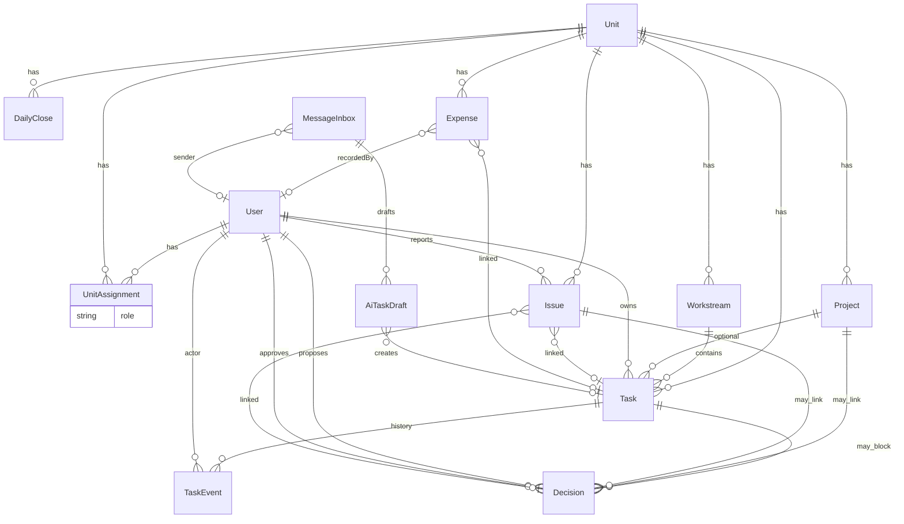

# HHG Oasis Control Tower — Target Architecture V1

**Date:** 2026-09-20  
**Based on:** `docs/SYSTEM_AUDIT_CURRENT_STATE.md` + operating model (Unit-scoped Lead/Support)  
**Constraints:** No standalone `Leader` entity. No auth redesign required in Phase 1. Document only — no DB migration in this step.

---

# 1. Business Model

## 1.1 Core idea

Quyền quản lý **không gắn với chức danh global**.  
Quyền gắn với **assignment của User trong từng Unit**.

```
User A
  ├── Unit: Lòng Nướng   → role LEAD
  ├── Unit: Spa          → role SUPPORT
  └── Unit: Pickleball   → role SUPPORT
```

- Ở **Lòng Nướng**, A có quyền Lead (xem/giao/quản lý workstream & task của unit).  
- Ở **Spa / Pickleball**, A chỉ SUPPORT (tham gia / cập nhật việc được giao hoặc tham gia — không mặc định quản lý cả unit).

## 1.2 What we deliberately do NOT create

| Rejected concept | Why |
|------------------|-----|
| `Leader` entity | Lead is a **role on UnitAssignment**, not a person type |
| Sidebar = list of leaders | Unstable IA; people change |
| Global “isLeader” flag on User | Violates multi-unit reality |

## 1.3 Stable domains

Operational hierarchy:

```
Organization (HHG Oasis)
 └── Unit (Lòng Nướng, Spa, …)
      └── Workstream (Marketing, Bếp, …)   ← configurable per unit
           └── Task
```

Optional overlay:

```
Project (cross-cutting or unit-scoped initiative)
 └── Task (optional projectId)
```

---

# 2. User Model

Audit: **no User model today**; owners are free-text strings.

## 2.1 Target entity: `User`

| Field | Type | Notes |
|-------|------|-------|
| id | cuid | Stable identity |
| name | string | Display name |
| status | ACTIVE / INACTIVE | Soft disable |
| avatarUrl | string? | Optional |
| phone | string? | Optional contact |
| email | string? | Optional; not auth-required in Phase 1 |
| titleLabel | string? | Cosmetic job title only (not permission) |
| createdAt / updatedAt | datetime | |

**Not in Phase 1:** password, OAuth, sessions. Identity can be selected in UI (“đang làm việc với tư cách…”) until auth lands.

## 2.2 Migration path off free-text

| Current field | Target |
|---------------|--------|
| `Task.owner` string | `Task.ownerUserId` (+ keep `ownerLabel` deprecated/read-only during transition) |
| `Project.owner` string | `Project.ownerUserId` |
| `Decision.proposer` | `Decision.proposerUserId` |
| `Decision.approver` | `Decision.approverUserId` |
| `Decision.resolvedBy` | `Decision.resolvedByUserId` |
| Issue (none) | `Issue.reportedByUserId`, `handledByUserId` |
| TaskEvent | `TaskEvent.actorUserId` |
| MessageInbox.senderDisplayName | `senderUserId` optional + display snapshot |

Rule: **UI always writes User IDs**; string labels only as denormalized display cache if needed.

---

# 3. Unit Assignment Model

## 3.1 Entity: `UnitAssignment` (aka UnitMembership)

| Field | Type | Notes |
|-------|------|-------|
| id | cuid | |
| userId | FK → User | |
| unitId | FK → Unit | |
| role | enum | see §4 |
| status | ACTIVE / ENDED | |
| startAt / endAt | optional | |
| createdAt / updatedAt | | |
| createdByUserId | optional | who assigned |

**Constraint:** unique `(userId, unitId, role)` **or** unique `(userId, unitId)` with single role per unit (recommended: **one active role per user per unit** to avoid LEAD+SUPPORT conflict).

Recommended: **`@@unique([userId, unitId])`** where `role` is the single active assignment. Changing Lead→Support = update role, not dual rows.

## 3.2 Cardinality

- One User → many UnitAssignments  
- One Unit → many UnitAssignments  
- User may LEAD many Units  
- User may SUPPORT many Units  
- User may LEAD Unit A and SUPPORT Unit B  

No hardcoded counts.

## 3.3 Existing `Unit` entity

Keep current `Unit` (id, name, sortOrder). It is already the correct anchor (audit confirms Unit is real and used).

---

# 4. Lead / Support Permission Model

## 4.1 Role naming (final recommendation)

| Role code | Vietnamese UI | Meaning |
|-----------|---------------|---------|
| **LEAD** | Lead / Phụ trách phân khu | Quản lý Unit + Workstream + Task trong scope Unit |
| **SUPPORT** | Support / Hỗ trợ | Tham gia / cập nhật việc được giao hoặc được gắn vào |
| **MEMBER** | Thành viên | Scope hẹp hơn SUPPORT (xem việc được assign; cập nhật hạn chế). Dùng khi cần phân tách “có mặt trong unit” vs “đang support việc cụ thể”. |

**Phase 1 product default:** implement **LEAD** + **SUPPORT**.  
Keep **MEMBER** in schema for extension; treat as SUPPORT-lite if unused.

Do **not** invent: MANAGER, ADMIN-as-unit-role (system admin is separate later).

## 4.2 Capability matrix (Unit-scoped)

Permission checks: `assignment.role` for `task.unitId` (or issue/decision’s unit).

| Capability | LEAD (that unit) | SUPPORT (that unit) | No assignment |
|------------|------------------|---------------------|---------------|
| View all Unit tasks | ✓ | ✗ (only assigned/participating) | ✗ |
| Create Task in Unit | ✓ | ✗* | ✗ |
| Assign / change owner | ✓ | ✗ | ✗ |
| CRUD Workstreams | ✓ | ✗ | ✗ |
| Update any Unit task | ✓ | ✗ | ✗ |
| Update own / participating task | ✓ | ✓ | ✗ |
| Update progress/status/note | ✓ | ✓ (own/participating) | ✗ |
| View overdue / blocked (Unit) | ✓ | limited to own set | ✗ |
| Create Issue for Unit | ✓ | ✓ | ✗ (or public QR later) |
| Link Issue → Task / Decision | ✓ | ✗ (request only) | ✗ |
| Request Decision | ✓ | ✓ (limited) | ✗ |
| Resolve Decision | configurable (often LEAD + designated approver) | ✗ | ✗ |

\*SUPPORT may *propose* task via AI/Issue; LEAD confirms.

## 4.3 Extensibility

Store capabilities as data later (`Permission` / policy table) if needed.  
V1: hardcode matrix in server helpers `can(user, action, resource)` reading `UnitAssignment`.

Cross-unit HQ roles (Finance, Giám đốc vận hành) = **separate system roles** later — not UnitAssignment. Out of scope for V1 assignment model, but leave hook: `User.systemRole` optional NULL.

---

# 5. Workstream Model

## 5.1 Naming choice: **Workstream**

| Candidate | Verdict |
|-----------|---------|
| Area | Too vague (geography vs function) |
| TaskGroup | Implementation smell |
| **Workstream** | Best: durable ops lane inside a Unit |

UI label VI: **Mảng việc** / **Nhóm công việc**.

## 5.2 Entity: `Workstream`

| Field | Type |
|-------|------|
| id | cuid |
| unitId | FK → Unit |
| name | string |
| description | string? |
| sortOrder | int |
| status | ACTIVE / ARCHIVED |
| createdAt / updatedAt | |

**Not hardcoded:** Marketing / Bếp / … are **data rows**, created by LEAD (or seeded per unit).

## 5.3 Relationship

```
Unit 1──* Workstream 1──* Task
```

Task.workstreamId **nullable** only during migration; target: required for unit execution tasks (except temporary inbox drafts).

LEAD manages Workstreams of their Unit only.

---

# 6. Task Model

## 6.1 Task remains the execution center

Audit already treats Task as the strongest live object — keep it.

## 6.2 Target relationships

```
Unit
 └── Workstream
      └── Task
           ├── optional Project
           ├── ownerUserId / assigneeUserId
           ├── TaskEvent[] (history)
           ├── Decision[] 
           └── Expense[] / Issue links
```

**Project is optional.**  
Example: “Sửa máy lạnh Lòng Nướng” → Unit + Workstream(Vận hành) + Task — **no Project required**.

| Field (target) | Notes |
|----------------|-------|
| unitId | Required for operational tasks |
| workstreamId | Required (after migration) |
| projectId | Optional |
| ownerUserId | Primary accountable |
| assigneeUserId | Optional if different from owner |
| status / progress / deadline / blocker / note | Keep |
| priority | Keep as field P0/P1/P2 (not entity) |
| updatedByUserId | Last actor |
| sourceMessageId / sourceDraftId | Promote to real FKs when possible |

## 6.3 History / audit trail

Every material change → `TaskEvent` with `actorUserId`, label, detail, timestamp.  
Staff/Lead/Support all update on web — no single data-entry proxy.

## 6.4 Everyone updates on web

Staff view becomes **“Việc của tôi”** filtered by `ownerUserId|assigneeUserId|participant` — not “all open tasks” (current audit gap).

---

# 7. Issue Workflow

Audit: Issue is **create-only dead-end**.

## 7.1 Target states

`OPEN → TRIAGED → IN_PROGRESS → LINKED_TASK | AWAITING_DECISION | CLOSED | REJECTED`

## 7.2 Fields

| Field | Purpose |
|-------|---------|
| reportedByUserId | Who reported |
| unitId | Where |
| workstreamId? | If known |
| assignedToUserId / handledByUserId | Triage owner |
| status | Above |
| linkedTaskId? | After B |
| linkedDecisionId? | After C |
| category / note / areaLabel | Keep |

## 7.3 Flow

```
Issue submit
 ↓
Triage (LEAD of unit, or designated handler)
 ↓
A. Close (no action)
B. Create/Link Task  → Issue.linkedTaskId; status LINKED_TASK
C. Request Decision  → Issue.linkedDecisionId; status AWAITING_DECISION
```

Decision resolve / Task progress can auto-advance Issue status (product rule TBD in §19).

---

# 8. Decision Workflow

Audit: Decision↔Task is the **strongest real logic** — preserve and extend.

## 8.1 Origins (source context)

Decision must reverse-trace:

- `linkedTaskId` and/or  
- `linkedProjectId` and/or  
- `linkedIssueId` (new)

Exactly one primary source preferred; others optional context.

## 8.2 Resolve side effects (keep + extend)

Keep current behavior for Task (APPROVED → unblock/DOING; NEEDS_INFO/REJECTED → BLOCKED + event).  
Extend: if `linkedIssueId`, update Issue status accordingly.  
Do **not** duplicate Task status into Decision beyond necessary fields.

## 8.3 Approver identity

`approverUserId` must be User — not free-text.  
Authorization: LEAD of unit, or named approver, or future system role.

---

# 9. AI Intake Workflow

Audit: AI confirm → Task works; missing Unit/Workstream/Project on confirm.

```
MessageInbox
 ↓ parse
AiTaskDraft (human check)
 ↓ confirm
Task {
  unitId, workstreamId, projectId?,
  ownerUserId, priority, …
}
```

Rules:
- AI is **intake only**, not a parallel work system.  
- Confirm UI **must** collect Unit + Workstream (+ Owner) before create.  
- Promote `createdTaskId` / `sourceDraftId` to real relations.  
- Close/archive MessageInbox after review (`REVIEWED`).

---

# 10. Finance Data Flow

Audit: DailyClose write REAL; Finance table + Dashboard metrics **MOCK**.

## 10.1 Source of truth

```
DailyClose (unitId + date)  →  aggregate API  →  Dashboard / Finance UI
Expense                     →  aggregate API  →  Dashboard / Expenses UI
```

**Forbidden:** hardcoded revenue/expense numbers in HTML as production truth.

## 10.2 Dashboard

Dashboard = **read-only aggregator**. No separate dashboard tables for KPIs.

## 10.3 Expense

Keep Expense→Unit, Expense→Task.  
Project link optional later (`projectId?`) — not blocking V1.

Revenue AI classify: either persist onto DailyClose note/metadata or remove from “save path” pretence.

---

# 11. People / Responsibility View

## 11.1 Page: **People** (VI: **Nhân sự / Trách nhiệm**)

Not a sidebar of names.

Entry:
- List/search Users  
- Or deep-link from Task owner chip  

## 11.2 User detail layout

```
{User.name}

LEAD
────────────────────────
Lòng Nướng
  totals: tasks / doing / overdue / blocked
  Workstreams:
    Marketing (n)
    Đồ ăn (n)
    …

SUPPORT
────────────────────────
Spa — tasks supporting (list/count)
Pickleball — tasks supporting (list/count)
```

Data sources:
- LEAD/SUPPORT sections ← `UnitAssignment`  
- Counts ← Task filtered by unitId + ownership/participation  
- Workstreams ← `Workstream` where unitId in LEAD units  

---

# 12. Add Leader / Assignment Flow

UI may say **“+ Thêm Lead”** — backend creates **UnitAssignment(role=LEAD)**, never a Leader row.

```
+ Thêm Lead / + Thêm Support / + Gán trách nhiệm
 ↓
Select existing User  OR  + Tạo người mới (User)
 ↓
Select Unit
 ↓
Select role = LEAD | SUPPORT (| MEMBER)
 ↓
POST UnitAssignment
```

Validation:
- Prevent two LEADs? **Product decision** (§19) — default allow multiple LEADs per Unit unless business forbids.  
- Replacing Lead = update/end previous assignment.

---

# 13. Current Feature Health Matrix

Derived strictly from `SYSTEM_AUDIT_CURRENT_STATE.md`.

| Feature | Status | Reason | Missing Connection | UI Warning |
|---------|--------|--------|--------------------|------------|
| Projects list + create | LIVE | Prisma CRUD via API | — | NORMAL |
| Tasks table + create + detail + progress | LIVE | Prisma + events | Form thiếu unit/workstream (target gap) | NORMAL* |
| Task filters (client) | LIVE | Client filter on real data | Heuristic overdue | NORMAL |
| Decisions list + create + approve/reject | LIVE | API + Task side-effects | Approver still string | NORMAL |
| Dashboard decision strip `#dashDecisions` | LIVE | Same renderDecisions | — | NORMAL |
| AI analyze → drafts → confirm/skip/merge | LIVE | Inbox + drafts → Task | Unit/Workstream on confirm incomplete vs target | NORMAL* |
| Expense list + create + reconcile | LIVE | Expense API | No Project link | NORMAL |
| Staff status buttons (BẮT ĐẦU/ĐÃ XONG/CÓ VẤN ĐỀ) | LIVE | Task PATCH | Not per-user (no User) | AMBER (PARTIAL identity) |
| DailyClose **save** modal | LIVE | Upsert API | UI read path not bound | NORMAL (write control) |
| Expense top metric **values** (4 cards) | PARTIAL | Values from summary; deltas HTML | Full bind | AMBER |
| Task create priority replace-gate | PARTIAL/MOCK | UI shows; not saved | Enforcement | AMBER/RED |
| AI confirm without Unit/Workstream fields | PARTIAL | Creates Task | Unit/Workstream/Owner User | AMBER |
| Issue **submit** | PARTIAL | POST works | Triage → Task/Decision; no list | AMBER |
| Staff “Việc của tôi” scope | PARTIAL | Shows all open tasks | User assignment filter | AMBER |
| Docs modal expenses | PARTIAL | Real expenses; unit-name fallback | Strict linkedTaskId only | AMBER |
| Dashboard KPI metrics (revenue/cash/expense/submitted) | MOCK | Hardcoded HTML | Bind summary | RED |
| Dashboard “3 ưu tiên cấp HHG” | MOCK | Hardcoded cards | Derive from Tasks/Projects | RED |
| Dashboard unit revenue cards | MOCK | Hardcoded | Bind dailyCloses | RED |
| Dashboard “Cần chú ý” risks | MOCK | Hardcoded | Compute from tasks/closes | RED |
| Finance alert + finance metrics | MOCK | Hardcoded | Bind summary/closes | RED |
| Finance **table** (read) | MOCK / NOT_CONNECTED | Hardcoded; pickle* unused | dailyCloses → DOM | RED |
| Expense breakdown / status / unit panels | MOCK | Hardcoded bars | Aggregate expenses | RED |
| Expense time-range filter | DEAD | No handler | Wire filter | RED |
| Role selector topbar | NOT_IMPLEMENTED / MOCK | No permission effect | User + UnitAssignment | RED |
| Revenue AI suggest persistence | NOT_CONNECTED | Classify only | Save into DailyClose | RED |
| Issue downstream workflow | NOT_CONNECTED | No triage UI/API links | Issue→Task/Decision | RED |
| Before/After photo scenes | MOCK | CSS demo | Media model | RED |
| Expense camera attach | MOCK | No upload | File storage | RED |
| Blueprint page | DEAD / ISOLATED | Static copy | Optional keep as docs | RED |
| Side panel “DỮ LIỆU MẪU” | MOCK | Chrome | Remove when live | RED |
| Date pill fixed 13/09/2026 | MOCK | Hardcoded | Real date / selected ops date | RED |
| People / Responsibility page | NOT_IMPLEMENTED | Absent | User + assignments | (n/a until built) |
| Workstream entity | NOT_IMPLEMENTED | Absent | Schema + UI | (n/a) |
| UnitAssignment | NOT_IMPLEMENTED | Absent | Schema + UI | (n/a) |

\*NORMAL for current honesty of “works with strings”; still incomplete vs target User model.

---

# 14. Target Information Architecture

| Domain | Purpose | Primary entities |
|--------|---------|------------------|
| Điều hành | Aggregate truth | DailyClose, Expense, Task, Decision (queries) |
| Công việc | Execute | Task, Workstream, Project?, TaskEvent |
| Quyết định | Approve blockers | Decision |
| Vận hành sự cố | Intake problems | Issue → Task/Decision |
| Tài chính | Money truth | DailyClose, Expense |
| Con người | Identity & duty | User, UnitAssignment |
| AI | Intake channel | MessageInbox, AiTaskDraft → Task |
| Hệ thống | Meta | Units, health, future auth |

Single source of truth: **Postgres via API**. UI never owns parallel KPI stores.

---

# 15. Target Sidebar

Max 6–7 groups. **No per-person sidebar items.**

```
Trung tâm điều hành

Công việc
  · Việc cần làm
  · Dự án
  · Quyết định

Vận hành
  · Vấn đề (Issues)
  · Việc của tôi          ← personal queue (SUPPORT/LEAD)

Tài chính
  · Chốt ngày / Doanh thu
  · Chi phí

Con người
  · Nhân sự / Trách nhiệm
  · Gán Lead & Support

AI
  · Hộp thư AI

Hệ thống
  · Phân khu (Units)
  · Sơ đồ / Ghi chú (optional)
```

Leader views = **filters / People detail**, not nav entries.

---

# 16. Current → Target Migration

| Current | Target action |
|---------|---------------|
| `Task.owner` string | Add `ownerUserId`; backfill by name match; deprecate string |
| Same for Project/Decision actors | Same pattern |
| Flat `Task.unitId` only | Add `Workstream`; backfill default “Chung” per Unit |
| Issue dead-end | Add triage fields + statuses + link APIs |
| Dashboard/Finance HTML KPIs | Delete hardcoded numbers; bind API |
| Role select fake | Replace with “acting as User” + real UnitAssignment checks |
| Staff all-tasks | Filter by User |
| AI confirm | Require unitId + workstreamId + ownerUserId |
| No Leader entity | Use UnitAssignment only |
| Decision projectName resolve | Select by projectId only |
| String Unit names in forms | Select by unitId |

Compatibility window: dual-write ID + label for 1–2 releases.

---

# 17. Target ER Diagram



**No `Leader` box.**

---

# 18. Migration Phases

### Phase A — Truthfulness (no User yet)
- Bind Dashboard / Finance table / Expense breakdowns to API  
- Remove fake success paths  
- Visual health badges (this step’s code exception)

### Phase B — Identity
- Add `User` + `UnitAssignment`  
- Dual-write owners; People page v1  
- Staff filter by selected User  

### Phase C — Workstream
- Add `Workstream`; default stream per Unit  
- Task forms require workstream  
- LEAD CRUD workstreams  

### Phase D — Issue loop
- Triage statuses + link Task/Decision  
- Issue list for LEAD  

### Phase E — AI alignment
- Confirm requires Unit/Workstream/Owner User  
- Harden FKs for draft↔task  

### Phase F — Permissions
- Enforce LEAD/SUPPORT matrix server-side  
- Replace decorative role select  

### Phase G — Auth (optional later)
- Login maps to User; drop manual “acting as”

---

# 19. Open Product Decisions

1. **Multiple LEADs per Unit allowed?** Default recommendation: yes.  
2. **MEMBER role in Phase B or defer?** Recommend defer; schema-ready.  
3. **Is assignee ≠ owner required in Phase B?** Recommend owner only first; assignee later.  
4. **Task.workstreamId required immediately after Phase C?** Recommend yes for new tasks; nullable legacy.  
5. **Who can resolve Decision?** LEAD only vs named approverUserId vs HQ role.  
6. **Issue QR public create without login?** Keep anonymous report with unit from QR; triage requires User.  
7. **Project placement in sidebar:** under Công việc (yes) vs separate top-level.  
8. **Finance vs “Chốt ngày” naming:** single page or split Doanh thu / Chi phí only.  
9. **Priority gate (“max 3 P1”)** — enforce in data or drop UI until real rule exists.  
10. **System roles (Finance, Giám đốc)** — timeline relative to UnitAssignment.

---

**END TARGET_ARCHITECTURE_V1.**  
Next allowed code change (exception): current-UI health warnings only.
