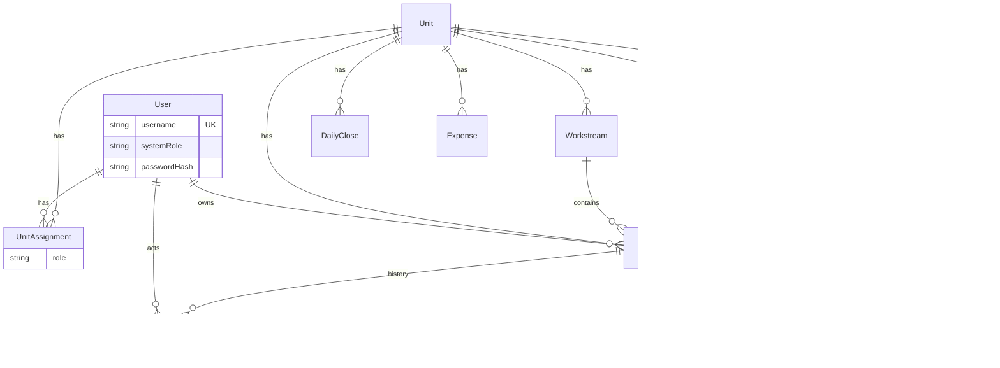

# HHG Oasis Control Tower — Target Operating Model + Information Architecture + Access Model

**Date:** 2026-09-20  
**Status:** Architecture design only — **no implementation in this phase**  
**Current-state sources (do not re-audit):**
- `docs/SYSTEM_AUDIT_CURRENT_STATE.md`
- `docs/SIDEBAR_CLASSIFICATION_CURRENT.md`
- Prior synthesis: `docs/TARGET_ARCHITECTURE_V1.md` (this doc **supersedes** access/auth sections of V1)

**Explicitly out of scope here:** full code refactor, DB migrate, feature delete, UI rebuild, hardcoding UnitAssignment for named users before PO confirmation.

---

# 0. Current classification (locked)

| Class | Items |
|-------|--------|
| CORE_WORKFLOW_OBJECT | Project, Task, Decision |
| WORKFLOW_ENTRY_POINT | AI Inbox → Task; Issue (intended → Task/Decision; currently orphan) |
| INDEPENDENT_BUSINESS_DOMAIN | DailyClose, Expense |
| ROLE_VIEW | Ứng dụng Lead/Tổ trưởng = **ROLE_VIEW OF TASK** |
| AGGREGATION | Trung tâm điều hành |
| UTILITY | Sơ đồ hệ thống |

**Principle:** Task remains the single execution object. Do **not** create a second Task system for “Leaders.”

---

# 1. Target Operating Questions

Every operational object should eventually answer:

| Question | Answered by |
|----------|-------------|
| WHO phụ trách? | `Task.ownerUserId` / `assigneeUserId` |
| WHERE? | `Task.unitId` → Unit |
| WHAT AREA? | `Task.workstreamId` → Workstream |
| WHAT? | Task title + status/progress |
| WHY / initiative? | optional `Task.projectId` |
| WHO ASSIGNED? | `Task.assignedByUserId` |
| STATUS? | Task.status |
| BLOCKER? | Task.blocker (+ open Decision if any) |
| DECISION needed? | Decision.linkedTaskId / linkedIssueId |
| HISTORY? | TaskEvent.actorUserId + timestamp |

---

# 2. Target Operating Model (entities)

## 2.1 Hierarchy

```
Organization (implicit: HHG Oasis)
 └── Unit                    ← operational / business unit (existing)
      ├── UnitAssignment[]   ← User × role on Unit (NEW)
      ├── Workstream[]       ← configurable lanes (NEW)
      │    └── Task[]
      ├── Project?[]         ← optional initiative container (existing)
      ├── DailyClose[]       ← independent finance domain
      ├── Expense[]
      └── Issue[]

Task ──optional──► Project
Task ──optional──► Decision (blocking)
Issue ──triage──► Task | Decision | Close
MessageInbox → AiTaskDraft → Task   (entry only)
```

## 2.2 Naming decisions

| Concept | Name | Why |
|---------|------|-----|
| Ops lane inside Unit | **Workstream** | Clearer than Area; less techy than TaskGroup. VI UI: “Mảng việc” |
| User×Unit role row | **UnitAssignment** | Not “Leader” |
| Lead responsibility | **role = LEAD** on UnitAssignment | Not a Leader entity |
| Global admin power | **systemRole = SYSTEM_ADMIN** on User | Never `username === "ADMINISTRATION"` |
| Unauthenticated overview | **GENERAL_OVERVIEW** context | Not a fake User |

## 2.3 Unit vs Workstream (anti-confusion)

| Unit | Workstream |
|------|------------|
| Lòng Nướng, Spa, Pickleball, … | Marketing, Bếp, Nhân sự, … **inside** a Unit |
| Existing Prisma `Unit` | New entity; **not** mixed into Unit table |
| Do not treat “Marketing” as a Unit | Do not treat “Lòng Nướng” as a Workstream |

Seed Unit names stay as DB truth — do not hardcode examples as schema enums.

---

# 3. Task = execution center

## 3.1 Rules

- Task is the only execution object.
- **Project optional.** Everyday ops tasks need Unit + Workstream only.
- Lead app / My Work / People views **reuse Task** — never duplicate stores.

## 3.2 Target Task fields (aligned to current schema)

Current: `owner` string, `unitId`, `projectId`, `priority`, `status`, `progress`, `deadline`, `blocker`, `note`, `sourceMessageId`, `sourceDraftId`, `TaskEvent[]`.

| Target field | Maps from / notes |
|--------------|-------------------|
| id, code, title | keep |
| unitId | keep; required for operational tasks |
| workstreamId | **NEW** FK → Workstream |
| projectId | keep; optional |
| ownerUserId | migrate from `owner` string |
| assigneeUserId | optional if ≠ owner |
| assignedByUserId | NEW |
| createdByUserId | NEW |
| priority | keep P0/P1/P2 field (not entity) |
| status | TODO/DOING/WAITING/BLOCKED/DONE |
| progress, deadline, blocker, note | keep |
| updatedByUserId | NEW (last actor) |
| sourceMessageId / sourceDraftId | promote to real FKs when possible |
| owner (string) | deprecate after backfill |

## 3.3 TaskEvent attribution

Extend current `TaskEvent { label, detail, taskId }`:

| Field | Notes |
|-------|-------|
| actorUserId | who did it |
| action | e.g. STATUS_CHANGE, ASSIGN, NOTE, CREATE |
| detail | human text |
| previousValue / newValue | optional JSON/string |
| createdAt | keep |

---

# 4. Workstream model

```
Unit 1──* Workstream 1──* Task
```

| Field | Type |
|-------|------|
| id | cuid |
| unitId | FK Unit |
| name | string |
| description | string? |
| sortOrder | int |
| status | ACTIVE / ARCHIVED |
| createdByUserId | optional |
| createdAt / updatedAt | |

- LEAD of that Unit (or SYSTEM_ADMIN) creates/edits Workstreams **from Web**.
- No hardcoded Marketing/Bếp list in code.
- Migration: create default Workstream `"Chung"` per Unit; backfill `Task.workstreamId`.

---

# 5. Project model

- Keep Project as **optional initiative container**.
- Project → many Tasks; each Task still has Unit + Workstream.
- `Project.ownerUserId` replaces string `owner`.
- `Project.createdByUserId` for attribution.
- Creating a Project does **not** auto-spawn Tasks.

---

# 6. User account model

## 6.1 Entity `User`

| Field | Type | Rules |
|-------|------|-------|
| id | cuid | |
| username | string **UNIQUE** | Exact case as product (e.g. `HOANGLE`) |
| displayName | string | Phase-1 default = username if unknown |
| passwordHash | string | bcrypt/argon2 — **never** plain text |
| systemRole | STANDARD_USER \| SYSTEM_ADMIN | |
| status | ACTIVE \| INACTIVE | |
| avatarUrl | string? | |
| lastLoginAt | datetime? | |
| createdAt / updatedAt | | |

**Forbidden:** password in `public/*`, client checks, or returned by API.

## 6.2 Initial accounts (seed plan — not execute yet)

| Username | systemRole | UnitAssignment | Status |
|----------|------------|----------------|--------|
| NGHIAPHAM | STANDARD_USER | **TBD** (PO) | ACTIVE |
| TIENPHAM | STANDARD_USER | **TBD** | ACTIVE |
| MICAHPHAM | STANDARD_USER | **TBD** | ACTIVE |
| HOANGLE | STANDARD_USER | **TBD** | ACTIVE |
| ANHNAM | STANDARD_USER | **TBD** | ACTIVE |
| ADMINISTRATION | **SYSTEM_ADMIN** | none required (global) | ACTIVE |

- Do **not** invent LEAD/SUPPORT rows until PO confirms.
- Do **not** invent real-world display names.
- Passwords: set via secure seed/env at implementation time — **not** documented as plaintext in repo docs beyond “set at deploy.”

## 6.3 ADMINISTRATION

- Is a **User** row with `systemRole = SYSTEM_ADMIN`.
- Authorization checks **`systemRole`**, never `username === "ADMINISTRATION"`.
- Username may stay `ADMINISTRATION` for human recognition only.

### SYSTEM_ADMIN capabilities (target)

| Area | Ability |
|------|---------|
| Users | create, deactivate, reset password flow |
| UnitAssignment | assign LEAD/SUPPORT/MEMBER |
| Units / Workstreams | CRUD |
| Task / Project / Issue / Decision | full override view/edit |
| DailyClose / Expense | full |
| System config | future flags |
| Data visibility | cross-unit |

STANDARD_USER: scoped by UnitAssignment + object ownership/participation (matrix below).

---

# 7. UnitAssignment (User ≠ Leader)

```
User 1──* UnitAssignment *──1 Unit
@@unique([userId, unitId])   // one active role per user per unit
```

| Field | Type |
|-------|------|
| id | cuid |
| userId | FK User |
| unitId | FK Unit |
| role | LEAD \| SUPPORT \| MEMBER |
| status | ACTIVE \| ENDED |
| assignedByUserId | optional |
| createdAt / updatedAt | |

**No Leader table.**

Roles:
- **LEAD** — manage Unit scope (tasks, workstreams, triage).
- **SUPPORT** — participate / update assigned or participating tasks.
- **MEMBER** — reserved (viewer/light); may defer enabling in UI.

Multiple LEADs per Unit: **allowed** unless PO later forbids (open decision).

---

# 8. Permission matrix (Unit-scoped)

Check: `UnitAssignment` for `resource.unitId`, else SYSTEM_ADMIN, else deny.

| Capability | LEAD | SUPPORT | MEMBER | SYSTEM_ADMIN | GENERAL_OVERVIEW |
|------------|------|---------|--------|--------------|------------------|
| View Unit all Tasks | ✓ | ✗ | ✗ | ✓ | read aggregates only |
| View own/participating Tasks | ✓ | ✓ | ✓ | ✓ | ✗ write context |
| Create Task in Unit | ✓ | ✗* | ✗ | ✓ | ✗ |
| Assign / change owner | ✓ | ✗ | ✗ | ✓ | ✗ |
| CRUD Workstream | ✓ | ✗ | ✗ | ✓ | ✗ |
| Update any Unit Task | ✓ | ✗ | ✗ | ✓ | ✗ |
| Update own Task status/progress/note | ✓ | ✓ | limited | ✓ | ✗ |
| Create Issue | ✓ | ✓ | ✓ | ✓ | ✗ |
| Triage Issue → Task/Decision | ✓ | ✗ | ✗ | ✓ | ✗ |
| Request Decision | ✓ | limited | ✗ | ✓ | ✗ |
| Resolve Decision | named approver / LEAD / admin | ✗ | ✗ | ✓ | ✗ |
| DailyClose / Expense write | finance policy / LEAD / admin | ✗ default | ✗ | ✓ | ✗ |
| Manage Users / assignments | ✗ | ✗ | ✗ | ✓ | ✗ |

\*SUPPORT may propose via Issue/AI; LEAD confirms.

Cross-unit HQ roles (Finance officer) = future `systemRole` / policy — not UnitAssignment. Leave hook only.

---

# 9. Assignment UX flows (data ops)

## 9.1 “+ Thêm Leader” (shortcut)

```
Select User → Select Unit → role=LEAD → Create UnitAssignment
```

Never `Create Leader`.

## 9.2 “+ Gán trách nhiệm” (general)

```
User → Unit → Role ∈ {LEAD, SUPPORT, MEMBER} → UnitAssignment
```

## 9.3 “+ Thêm tài khoản” (SYSTEM_ADMIN)

```
username + displayName + initial password → Create User (STANDARD_USER)
then separately: Gán trách nhiệm
```

Do not merge Create User with Make Lead.

---

# 10. Access model: GENERAL_OVERVIEW + authenticated Workspace

## 10.1 Open URL (product decision)

```
Open link
 → GENERAL_OVERVIEW (Command Center / Dashboard)
 → Read-only aggregates
 → currentUser = null (not ADMINISTRATION)
```

**No login wall** on first paint.

## 10.2 Write gate

Any write (Task create/edit, Project, Decision resolve, Issue triage, DailyClose, Expense, User, Workstream, Assignment…):

```
if !authenticatedSession
  → prompt: "Vui lòng chọn tài khoản để tiếp tục."
  → open Account Selector
```

## 10.3 Replace top-right role dropdown

Current: decorative “Giám đốc vận hành” (no permission effect — audit).

Target: **Account / Context Switcher**

| State | Control |
|-------|---------|
| General | `[ Tổng quan HHG Oasis ▼ ] [ avatar ]` |
| Authenticated | `[ HOANGLE ▼ ] [ HL ]` |

Never use job-title strings as identity.

## 10.4 Account Selector contents

```
TỔNG QUAN
  ✓ Tổng quan HHG Oasis

TÀI KHOẢN
  NGHIAPHAM
  TIENPHAM
  MICAHPHAM
  HOANGLE
  ANHNAM

HỆ THỐNG
  ADMINISTRATION
```

When assignments exist, **subtitle** (not duplicate rows):

```
HOANGLE
Lead · Lòng Nướng
Support · Spa, Pickleball
```

Future grouping (same User table):

```
LEADERS
MEMBERS
SYSTEM
```

Still one User list — grouping is UX filter by whether user has any LEAD assignment.

## 10.5 Password gate

```
Select HOANGLE
 → Password modal (label "MK:", type=password, show/hide ok)
 → POST /api/auth/login { username, password }
 → Server: find user, ACTIVE?, verify hash, create session
 → Return safe user + assignments (no passwordHash)
 → Enter HOANGLE Workspace
```

Switch HOANGLE → ANHNAM: **same modal**; no silent switch.

## 10.6 Session rules

- Session holds: `userId`, `username`, `systemRole`, `unitAssignments[]`.
- Protected APIs read **session only** — ignore client-supplied role/userId for authz.
- Cookies: httpOnly secure session (implementation detail later).

## 10.7 Return to “Tổng quan HHG Oasis”

| Option | Behavior | Pros | Cons |
|--------|----------|------|------|
| **A. Full logout** | Destroy session → GENERAL_OVERVIEW | Safest; no accidental writes | Re-enter password often |
| B. Soft overview | Keep session; UI “overview mode” with writes still allowed as user | Convenient | Easy to think you’re anonymous while still privileged |

**Recommendation: A — full logout** when choosing Tổng quan from switcher.

Rationale: product text treats overview as anonymous/read-only; soft mode risks accidental writes under a forgotten session. “Vào tài khoản” again is acceptable cost.

Open to PO if they prefer B with a visible “Đang đăng nhập: HOANGLE — chỉ xem tổng quan” banner + write still attributed.

---

# 11. Authenticated workspace views (same Task SoT)

| View | Purpose | Data |
|------|---------|------|
| **MY WORK** | Personal execution | Tasks where owner/assignee/participant = me |
| **LEAD RESPONSIBILITY** | Units I LEAD | All tasks/workstreams in those units |
| **PEOPLE / RESPONSIBILITY** | Admin/peer look at a User | Assignments + aggregated Task counts by Unit/Workstream |
| Current “Lead/Tổ trưởng” page | Evolve into MY WORK (+ LEAD board), not new DB | Task PATCH remains |

People view example structure (UX):

```
{displayName}

LEAD
  Unit …
    counts + workstream breakdown
SUPPORT
  Unit … supporting tasks
```

No separate Task table for People.

---

# 12. Attribution on other objects

| Object | Actor fields (target) |
|--------|------------------------|
| Task | createdBy, owner, assignee, assignedBy, updatedBy + TaskEvent.actor |
| Issue | reportedBy, handledBy |
| Decision | proposer, approver, resolvedBy |
| Expense | createdBy, reconciledBy |
| DailyClose | submittedBy, reconciledBy |
| Project | createdBy, owner |
| Workstream | createdBy |
| UnitAssignment | assignedBy |

Migrate off free-text proposer/approver/owner gradually (dual-write window).

---

# 13. Issue lifecycle (fix orphan)

```
Issue submit (auth or QR policy TBD)
 → status OPEN
 → TRIAGE (LEAD of unit / SYSTEM_ADMIN)
 → A. CLOSE
 → B. Create/Link Task  → linkedTaskId, status LINKED_TASK
 → C. Request Decision → linkedDecisionId, status AWAITING_DECISION
```

Target fields: `reportedByUserId`, `unitId`, `workstreamId?`, `handledByUserId`, `status`, `linkedTaskId`, `linkedDecisionId`.

Decision/Task progress may later auto-advance Issue (PO rule).

---

# 14. Decision / AI / Finance (unchanged principles)

- **Decision:** keep Task block/resolve logic; add `linkedIssueId`; User IDs for actors.
- **AI:** intake only; confirm requires Unit + Workstream + ownerUserId before Task create.
- **DailyClose / Expense:** independent domains; Dashboard only aggregates — **no** HTML second SoT.
- **Expense↔Task** optional; not required for Expense LIVE.

---

# 15. Target Information Architecture (sidebar direction)

Stable domains (not per-person nav). **Not implementing now** — design only.

```
Trung tâm điều hành          ← AGGREGATION (GENERAL_OVERVIEW default)

Công việc
  · Việc cần làm (Task)
  · Dự án
  · Quyết định

Vận hành
  · Việc của tôi            ← ROLE_VIEW (auth)
  · Vấn đề (Issue)

Tài chính
  · Chốt ngày / Doanh thu
  · Chi phí

Con người
  · Nhân sự / Trách nhiệm
  · Gán Lead & Support      ← SYSTEM_ADMIN / LEAD policy

AI
  · Hộp thư AI

Hệ thống
  · Tài khoản (admin)
  · Phân khu / Workstream
  · Sơ đồ (utility)
```

Account switcher lives in **top bar**, not sidebar.

---

# 16. Target ER (conceptual)



**No Leader entity.**

---

# 17. Migration phases (plan only)

| Phase | Focus | Notes |
|-------|-------|-------|
| **P0** | Truthfulness | Bind Dashboard/Finance/Expense analytics to API; keep health badges |
| **P1** | User + Auth | User table, passwordHash, session, Account Selector, GENERAL_OVERVIEW write-gate; seed 6 usernames **without** UnitAssignment TBD |
| **P2** | UnitAssignment | Assign UI; LEAD/SUPPORT matrix on APIs; evolve Lead page → My Work |
| **P3** | Workstream | Entity + default “Chung”; Task forms require workstream |
| **P4** | Attribution | Replace string owners; TaskEvent.actorUserId |
| **P5** | Issue loop | Triage + link Task/Decision |
| **P6** | AI confirm | Require Unit/Workstream/ownerUserId |
| **P7** | People view | Responsibility page from same Task SoT |

No phase hardcodes LEAD for NGHIAPHAM/… until PO table is filled.

---

# 18. Open product decisions

1. Multiple LEADs per Unit — allow? (default **yes**)  
2. Enable MEMBER in UI in P2 or later?  
3. assignee ≠ owner in P1 or later?  
4. Who resolves Decision: LEAD only vs approverUserId vs SYSTEM_ADMIN?  
5. Issue QR anonymous create vs auth-only?  
6. Return to overview: confirm **logout (A)** vs soft mode (B)?  
7. Initial passwords delivery method (1Password / env / force-change)?  
8. DisplayNames for 6 accounts when known?  
9. UnitAssignment TBD sheet from PO (who leads which Unit)?  
10. Finance write: which roles beyond SYSTEM_ADMIN?

---

# 19. What this phase does **not** do

- No Prisma migrate / seed execute  
- No auth API implement  
- No sidebar restructure in code  
- No deleting mock UI yet (beyond existing diagnostic badges)  
- No inventing Leader entity  
- No guessing UnitAssignment for NGHIAPHAM…  

---

# 20. Document map

| Doc | Role |
|-----|------|
| SYSTEM_AUDIT_CURRENT_STATE.md | What exists / health |
| SIDEBAR_CLASSIFICATION_CURRENT.md | What each nav item *is* |
| TARGET_ARCHITECTURE_V1.md | Earlier target sketch |
| **This file** | Operating model + IA + User/Lead/Access for next implementation phase |

**END ARCHITECTURE PHASE.** Awaiting PO confirmation on TBD assignments + open decisions before implementation.
